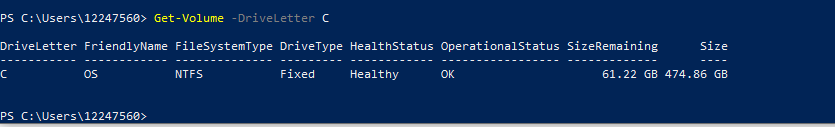
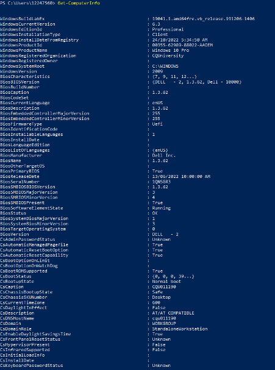
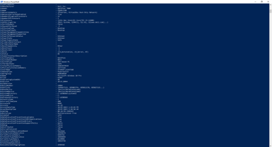
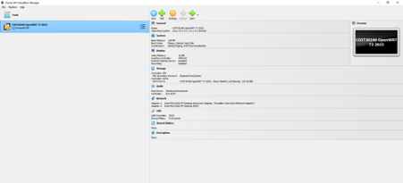
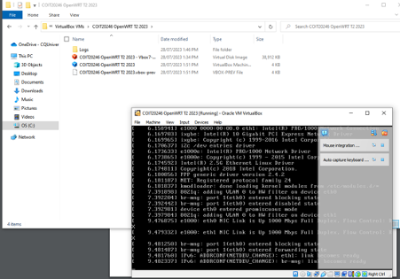
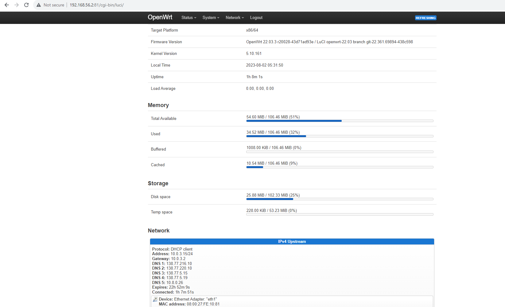
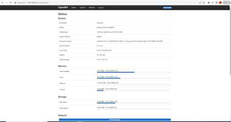

# Week 1 | Computer Systems and Applications

## Task 3. View Your Computer Information

The details of my computer are ...  
The Disk Value is 474.86 GB
  

The RAM Value is 474.86 GB

The following is a screenshot of the details:  
  
  
  

## Task 4. Deploy Linux Web Server in VirtualBox
  
  

How I Found the Value 
1. Go to the IP Address: 192.168.56.2:81
2. Enter Authorization Details (Username - root & Password - student)
3. It will direct you to the OpenWRT overview where you can find the Kernel version   
     
Device: Ethernet Adapter: "eth1"  
MAC address: 08:00:27:FE:10:81  
Kernel Version	is 5.10.161  
BOOT Manager is GNU GRUB.   

## Q1
<b>Boot Manager:</b>
A boot manager, also known as a bootloader, is a small program responsible for loading the operating system into memory during the computer's startup process. It allows users to choose between different operating systems if a computer has multiple operating systems installed. The value of the boot manager lies in its ability to initiate the boot process, load the kernel, and handle the selection of the desired operating system.

<b>Kernel:</b>
The kernel is the core component of an operating system. It is responsible for managing the system's resources, facilitating communication between hardware and software, and ensuring the smooth execution of processes and applications.

The value of the kernel is its critical role in maintaining the stability and functionality of the operating system. It controls low-level functions, such as memory management, task scheduling, device drivers, and system calls. The choice of the kernel can significantly impact the performance and capabilities of an operating system.
   
## Q2
<b>VirtualBox and OpenWRT</b> 
VirtualBox is a powerful and widely-used type 2 hypervisor that allows users to create and run virtual machines on their existing operating system. It enables users to install and operate multiple guest operating systems within their host system, providing a virtualized environment for testing, development, or running software across various platforms. VirtualBox offers robust features such as snapshotting, shared folders, and virtual networking, making it an excellent choice for both personal and professional use.
 
OpenWRT, on the other hand, is a Linux-based open-source operating system designed for embedded devices, particularly wireless routers. It offers a flexible and customizable platform, empowering users to optimize and enhance the capabilities of their routers through the installation of additional software packages. OpenWRT's lightweight nature and extensive package repository make it a popular choice among networking enthusiasts and developers looking to extend their router's functionality beyond standard firmware options.

## Q3
 
VirtualBox is a type 2 hypervisor that allows users to create and manage virtual machines on their existing operating systems. It is a virtualization tool designed to facilitate running multiple guest operating systems within a host system. VirtualBox is commonly used for testing software across different platforms, software development, and creating isolated environments for specific applications. It provides a user-friendly interface and features like snapshotting and virtual networking, making it a popular choice for both personal and professional use.

On the other hand, OpenWRT is an open-source Linux-based operating system tailored for embedded devices, particularly wireless routers. Unlike VirtualBox, OpenWRT is not a virtualization tool but rather a firmware replacement for routers. Its primary purpose is to enhance the functionality of routers by providing a lightweight and customizable platform. Users can extend their routers' capabilities by installing additional software packages from a vast repository. OpenWRT is favored by networking enthusiasts and developers seeking to optimize their routers beyond standard firmware options.

In summary, VirtualBox is a virtualization software for running multiple operating systems within a host system, while OpenWRT is an open-source operating system designed to enhance the functionality of wireless routers. They cater to different needs and use cases in the computing and networking realms.  

## Task 5. Browse to OpenWRT Websites
  
  
  

