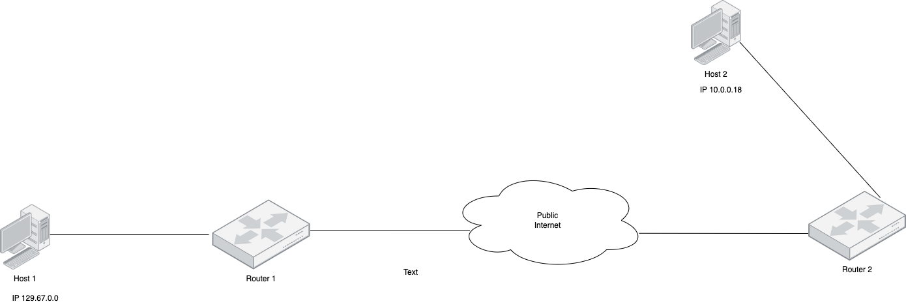

# Week 2 | Computer Networks and the Internet

## Task 2. View Your Addresses

  

## Task 3. Ping Your Local Router

  

  

### Q2
- Minimum = 1ms
- Average = 2ms
- Maximum = 3ms

## Task 4. Ping your OpenWRT Linux Server
### Q1
-  **ip addr**
-  inet 127.0.0.1/8
-  inet 10.0.3.15/24
-  inet 192.168.56.2/24

#### Q2

- **tcpdump command** : tcpdump -i eth1 -w capture.pcap

## Task 5. Ping your OpenWRT Linux Server

  
  
### Q2

- Each line in the output represents a network hop. 

### Q3
- Distance of the network, network traffic and processing time.    
## Task 6. Draw a Network Diagram
  

## Task 7. Find Addresses of a Website

- Address: Spotify.com
- I found the address of this website using the Domain Name (URL) and Physical Location using 'Contact Us' or 'About' page.
## Task 8. Home Internet Connection
  
  

### Q2

- ISP: Vocus
  
1. Test 1: 27.43 Mbps Download, 18.32 Mbps Upload - Data Rate: 43 Download 27 Upload
2. Test 2: 33.86 Mbps Download, 18.29 Mbps Upload - Data Rate: 49 Download 28 Upload

### Q3
- Priority provided by the ISP.
- Network traffic

