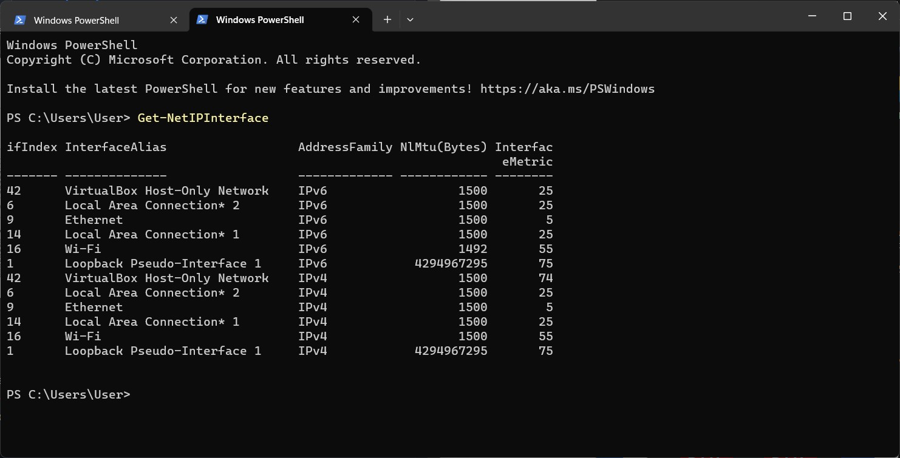
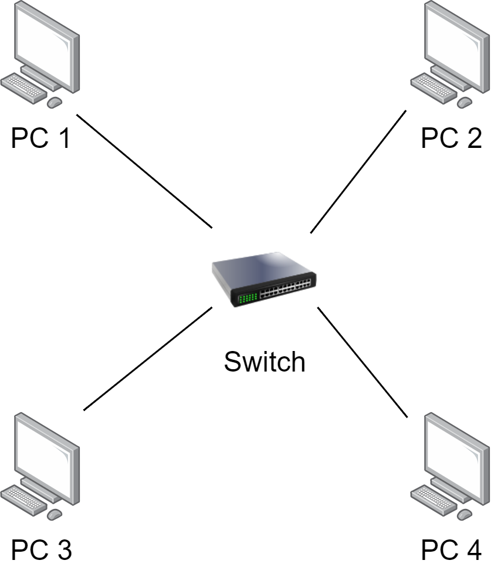
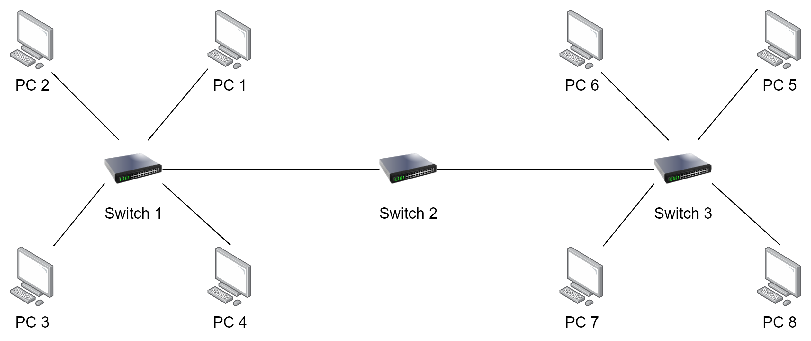
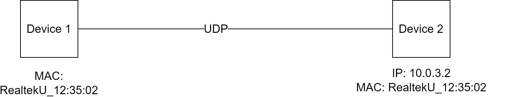

# Week 3 | Network Technolgoies

## Task 2. View ARP Table

  

## Task 3. Draw Network Diagrams

## Task 4. Analyse Ping Packet Capture

### Q2
  

## Q4
 ARP is used to link with other devices within a local network. ARP is used to convert IP address to MAC address. Address Resolution Protocol (ARP) packets serve the essential purpose of enabling communication between devices in a local network. In an IP-based network, devices use IP addresses to identify each other, but data transmission at the data link layer (Layer 2) requires physical hardware addresses (MAC addresses). ARP acts as a bridge between these two layers, allowing devices to map IP addresses to corresponding MAC addresses.

When a device needs to send data to another device within the same network, it first checks its ARP cache to find the MAC address associated with the destination IP address. If the destination MAC address is not found in the cache, the device broadcasts an ARP request packet, asking "Who has this IP address?" The device with the matching IP address replies with an ARP reply packet, providing its MAC address. Subsequently, the requesting device updates its ARP cache with the IP-to-MAC address mapping.

ARP packets are crucial for efficient network communication, as they help devices discover and maintain the necessary information to route data packets appropriately. By resolving IP addresses to MAC addresses, ARP enables devices to send data directly to the intended recipient within the local network, reducing unnecessary network traffic and enhancing overall network performance.

## Q5
ICMP Echo Request:
The ICMP Echo Request is commonly known as a "ping" request. It is sent by a device to another device in the network to check if the target device is reachable and responsive. When a device sends an ICMP Echo Request, it includes its own IP address and a unique Identifier, along with a sequence number. The receiving device responds with an ICMP Echo Reply (Type 0), containing the same Identifier and sequence number, indicating that it is operational and reachable.

ICMP Destination Unreachable:
The ICMP Destination Unreachable packet is used by routers or devices to report that they cannot forward a packet to its intended destination. When a router receives a packet that it cannot deliver, it generates an ICMP Destination Unreachable packet and sends it back to the source IP address. The packet includes specific codes to indicate the reason for the failure, such as "Destination Host Unreachable" or "Destination Port Unreachable." This information helps network administrators diagnose and troubleshoot connectivity issues.

In summary, the first two ICMP packets, ICMP Echo Request, and ICMP Destination Unreachable, play crucial roles in network diagnostics and communication. ICMP Echo Requests are used to check the reachability of devices in the network, while ICMP Destination Unreachable packets are used to report failures in delivering packets to their intended destinations, assisting in network troubleshooting and ensuring efficient data transmission.

## Task 5. Learning Reflection

- Tools: Powershell , VirutalBox, FileZilla, Putty, Wireshark
- VirtualBox: I can use VirtualBox to create an environment for testing new applications and experimenting with different configurations. Also, You can try out different operating systems like Linux, Ubuntu and Windows. VirtualBox is a type 2 hypervisor that allows users to create and manage virtual machines on their existing operating systems. It is a virtualization tool designed to facilitate running multiple guest operating systems within a host system. VirtualBox is commonly used for testing software across different platforms, software development, and creating isolated environments for specific applications. It provides a user-friendly interface and features like snapshotting and virtual networking, making it a popular choice for both personal and professional use.
