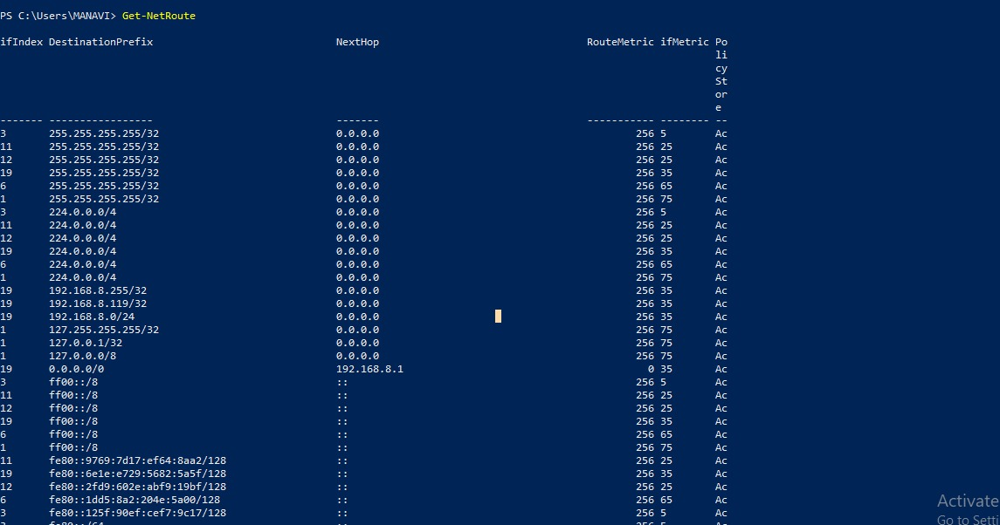
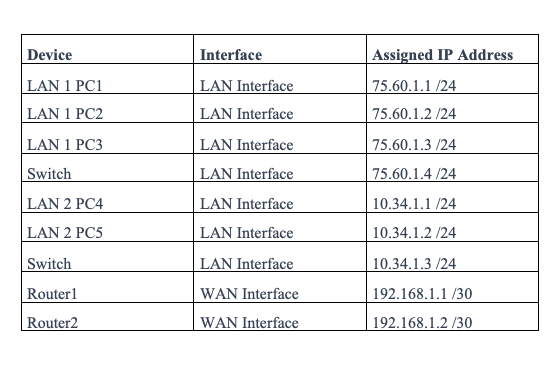
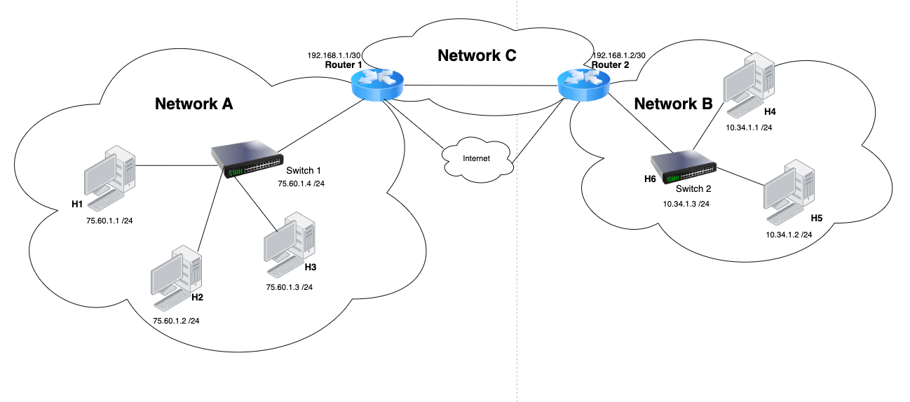
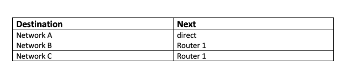
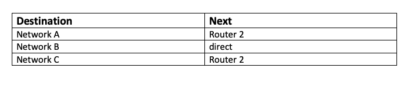
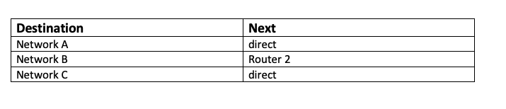
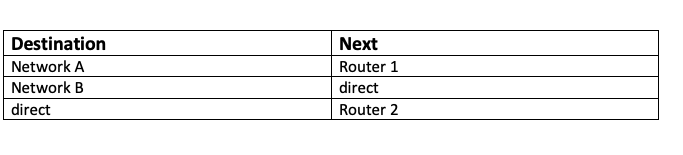
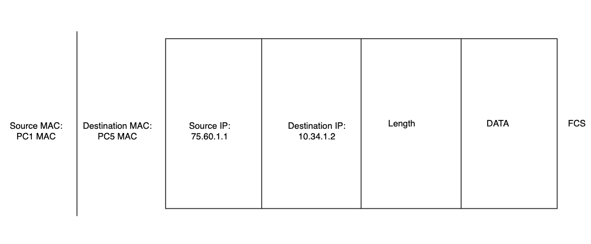
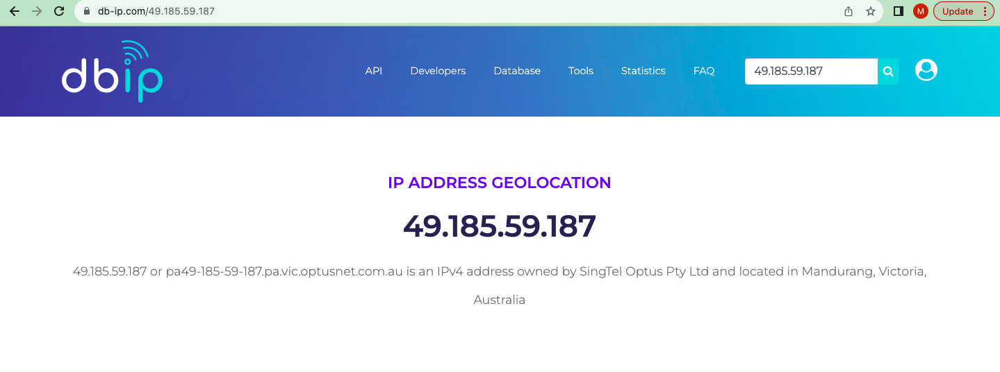
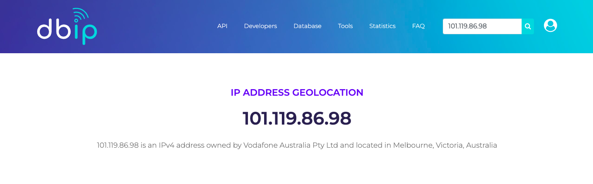

 
# Week 4 | Internetworking

## Task 2. View Routing Table

  

### Read Table as follows:

- To send to all devices on the same network as me, send direct
(not to another router).
- To send to special multicast addresses starting 224, send direct.
- To send to all devices on the network 192.168.8.0, i.e. directed broadcast, send
direct.
- To send to the device 192.168.8.119, send direct.
- To send to anyone on the network 192.168.8.0, send direct.
- To send to all devices on the network 127.0.0.0, i.e. directed broadcast, send
direct.
- To send to the device 127.0.0.1, send direct.
- To send to anyone on the network 127.0.0.0, send direct.
- To send to anyone else in the Internet, send to 192.168.8.1

## Task 3. IP Network Design
- My Student ID: 12247560
- Partner's Student ID: 12231034
  
### Part a)
  

### Part b)
  

### Part c) Routing Tables

#### Routing Table for H1, H2, H3
  

#### Routing Table for H4, H5
  

#### Routing Table for Router 1
  

#### Routing Table for Router 2
  

### Part d) Packet Diagram
  

## Task 4. IP Address Lookup

### IP Address lookup via home WIFI
  

### IP Address lookup via mobile internet
  

- For Home WiFi (IP: 49.185.59.187):

The geolocation identified my IP address as owned by SingTel Optus Pty Ltd.
It located the IP in Mandurang, Victoria, Australia.
The geolocation provided an accurate general location, recognizing that my IP is associated with my ISP, SingTel Optus Pty Ltd, and placing it in Mandurang, Victoria, Australia. However, it didn't reveal my exact location or city.

- For Mobile Phone (IP: 101.119.86.98):

The geolocation identified my IP address as owned by Vodafone Australia Pty Ltd.
It located the IP in Melbourne, Victoria, Australia.
In the case of my mobile phone, the geolocation accurately identified the general area associated with my mobile carrier's data center, which is Melbourne, Victoria, Australia. Just like with the home WiFi, it did not provide my exact location within the city.

Overall, these results reflect the typical level of accuracy for IP geolocation, which usually provides an approximate location at the city or regional level, rather than the exact address.

## Task 5. IP Addresses, VPNs and Contract Cheating

### a) Reasons for and against bypassing geolocation (or geo-blocking) services with a VPN:

#### Reasons for bypassing geo-blocking:

- Access to home-country content: Students may want to access web services or content that are only available in their home country, such as streaming services, news websites, or specific online resources.
  
- Privacy and security: VPNs can enhance online privacy and security by encrypting internet traffic, which can be appealing to students who want to protect their data and online activities.
  
#### Reasons against bypassing geo-blocking:

- Violation of terms of service: Using a VPN to access content restricted to certain regions may violate the terms of service of web services or platforms, potentially leading to account termination or legal consequences.
  
- Ethical concerns: Some argue that bypassing geo-blocking can raise ethical concerns, as it may undermine licensing agreements and the revenue models of content providers.
  
### b) Reasons for and against a university using IP addresses to identify possible contract cheating:

#### Reasons for using IP addresses:

- Academic integrity: Monitoring IP addresses can help universities maintain academic integrity by identifying potential cases of contract cheating or unauthorized collaboration.
  
- Deterrence: The knowledge that IP addresses are monitored may deter students from engaging in contract cheating, promoting fair academic practices.

#### Reasons against using IP addresses:

- False positives: IP addresses alone may not provide definitive evidence of contract cheating, as there could be legitimate reasons for students accessing learning systems from different locations, such as travel or using a VPN for privacy.
  
- Privacy concerns: Monitoring IP addresses raises privacy concerns, and universities must strike a balance between ensuring academic integrity and respecting students' privacy rights.

### c) Advice for future students regarding using a VPN while studying in Australia:

It's important for future students to be aware of the implications, enhancements and make informed decisions about using VPNs:

- Understand the terms of service: Familiarize yourself with the terms of service of web services you use daily, such as online learning platforms or streaming services. Using a VPN to bypass geo-blocking may violate these terms and could have consequences.

- Academic integrity: Be aware of your university's policies on academic integrity. While VPNs can provide privacy and security benefits, they should not be used to engage in academic misconduct, such as contract cheating.

- Use VPNs responsibly: If you choose to use a VPN, use it responsibly and ethically. Ensure that your VPN usage aligns with the intended purpose of enhancing online privacy and security rather than circumventing content restrictions.

- Respect local laws: Understand the legal implications of using VPNs in Australia. While VPNs themselves are legal, their usage for illegal activities can have legal consequences.

- Consider alternatives: Instead of bypassing geo-blocking, explore legal alternatives for accessing content or services. Some services offer global access to users, or you may find equivalent resources locally.

