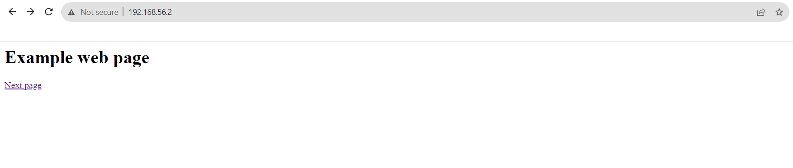

# Week 5 | Internet Applications

## Task 3. Create Web Pages in OpenWRT
- files created
     - index.html
     - 12247560.html
     - styles.css

- Screenshot
     -   
     -   
## Task 4. Capture HTTP Packets
- HTTP packet capture file - This file is in the Diagrams folder.
- Screenshot of the ARP Table
  
-    
  
## Task 5. Analyse HTTP Packet Capture
### a) 
Packet 4: This packet is a GET request from the source IP address 192.168.56.1 to the destination IP address 192.168.56.2 using HTTP. The request is for the resource "/index.html" over HTTP/1.1.

Packet 8: This packet is a response to the previous GET request. It's from 192.168.56.2 to 192.168.56.1, and it indicates that the HTTP request was successful with a "OK" status. The response is an HTML content.

Packet 14: Another GET request from 192.168.56.1 to 192.168.56.2, this time for the resource "/12247560.html" by HTTP/1.1.

Packet 17: This is a successful response to the GET request for "/12247560.html" with a "OK" status. Again, it is an HTML content.

Packet 18: Another GET request from 192.168.56.1 to 192.168.56.2, this time for "/styles.css" over HTTP/1.1.

Packet 21: A successful response to the GET request for "/styles.css" with a "OK" status. This response likely contains CSS content.

### b) 

Source : 192.168.56.1  
Destination : 192.168.56.2  
Source Port: 52518  
Destination Port: 80  
Protocol: TCP  

### c) 

There are no interactive elements like buttons or responses, is often powered by JavaScript running in my browser. JavaScript can handle tasks locally, including displaying the date and time when you click a button, without the need for a server request. 
     
### d)
### Packet Diagram
-   

- Ethernet
  Source: 0a:00:27:00:00:29
  Destination: 08:00:27:e2:98:d6
  
- draw.io file is uploaded in the diagrams folder.
    
### e)
 The "Referer" is an HTTP header field that can be included in an HTTP request which is sent by a web client to inform the web server about the source of the request. It identifies the URL of the relevant web page or resource from which the current request was initiated. The "Referer" header helps web servers directly understand the context of the request and how the user arrived at the current page.
       
### f)
 Despite the absence of specific User-Agent values and detailed browser information in the packet capture data, web servers can usually glean more accurate details about the web browser from the User-Agent header. This extracted information often encompasses the browser's name, version, and the platform it is operating on. This data serves various functions, including analytics, optimizing content, and ensuring compatibility across various web browsers.

### g)
 - HTTP/1.1 as the version of the HTTP protocol
 - TCP (Transmission Control Protocol) used as transport protocol
  
### h)

Time for connection setup = ( Packet 2 - Packet 1 ) * average time taken to transmit a packet over the network = (2-1) * 0.000049 = 0.000049 seconds.

So, it took approximately 0.000049 seconds for the connection setup to complete before the data transfer started.

### i)
### Situations where acknowledgements are sent:

- During Connection Establishment: In the three-way handshake, acknowledgments are exchanged to establish a connection. The client sends an ACK to acknowledge the server's SYN-ACK, and the server acknowledges the client's ACK.

- After Data Reception: After receiving data packets, the receiver (either the client or the server) sends ACK packets to confirm that the data has been received successfully. This helps ensure that data is transmitted reliably, and missing or corrupted packets can be retransmitted if necessary.

- Flow Control: ACKs can also be used for flow control, indicating the receiver's readiness to receive more data without overwhelming its buffer.

Acknowledgments are typically sent in TCP to confirm the successful receipt of data packets, establish and confirm connections, and manage the flow of data between the sender and receiver to ensure reliable communication.

## Task 6
When I visited a supermarket website, such as an online grocery store, cookies can store specific types of information related to browsing and shopping experience. Here are some of the common types of information found in cookies on a supermarket website:

- Shopping Cart Data: Cookies can store information about the items we have added to the virtual shopping cart. This allows us to browse the website, add products, and continue shopping without losing track of our selected items.

- User Account Information: If we have an account on the website, cookies may store details like your username, email address, and authentication tokens to keep we logged in across sessions.

- Preferences: Cookies can remember your preferences, such as our choice of delivery location, preferred store branch, or language settings.

- Search History: Information about our recent product searches or viewed products may be stored in cookies to provide us with personalized product recommendations or to help us easily revisit items of interest.

- Session Identification: Cookies often contain session identifiers or tokens that help the website maintain a continuous session, ensuring a seamless shopping experience as we navigate the site.

- Promotions and Discounts: If we interact with promotions, discounts, or coupon offers on the website, cookies may store data related to those interactions. For example, they might remember that we have clicked on a specific promotion.

- Analytics and Tracking: Supermarket websites may use cookies to collect analytics data, such as which products are popular, how long users spend on certain pages, and how they navigate through the site. This data helps improve the website's functionality and user experience.

- Payment Information: In some cases, especially if we choose to save payment details for convenience, cookies may store encrypted payment information or references to payment tokens.

- Delivery Preferences: If we've set delivery preferences, such as delivery time slots or recurring delivery schedules, cookies can store this information for our convenience.

