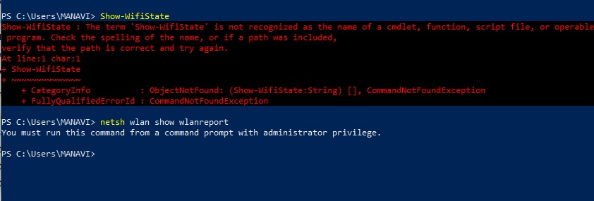

# Week 6 | Wireless Networks

## Task 2. View Wi-Fi Details

  

## Task 3. Use Wi-Fi Access Point

Designing a Wi-Fi network involves several important settings that need to be considered to ensure optimal performance and security. Here are some crucial settings to keep in mind:

- Frequency Band: Choose the appropriate frequency band (2.4 GHz or 5 GHz) based on your network's requirements. 5 GHz is less congested but has shorter range, while 2.4 GHz offers better range but can suffer from interference.

- Channel Selection: Avoid overlapping channels by selecting channels that do not interfere with nearby Wi-Fi networks. Use tools like Wi-Fi analyzers to identify the least congested channels.

- SSID (Service Set Identifier): Assign a unique and easily identifiable SSID to your network. Avoid using default or common SSIDs to enhance security.

- Security Mode: Implement strong security protocols such as WPA3-PSK (Pre-Shared Key) or WPA2-Enterprise for encryption and authentication. Never use open (unsecured) networks.

- Password and Passphrase: Use strong, complex passwords or passphrases to secure access to your network. Avoid using easily guessable information.

- Guest Network: Create a separate guest network with limited access to your main network. This prevents guests from accessing sensitive data.

- MAC Address Filtering: Restrict network access to specific devices by allowing only authorized MAC addresses.

- Quality of Service (QoS): Prioritize certain types of traffic, such as video conferencing or streaming, to ensure a smooth user experience.

- Network Range: Position access points strategically to ensure even coverage throughout your intended area while minimizing dead zones.

- Channel Width: Adjust channel width to balance data rate and coverage. Wider channels provide higher data rates but may lead to more interference.

- Roaming: Set up seamless roaming by configuring multiple access points with the same SSID. This allows devices to switch between APs without interruption.

- Backup Configuration: Keep backups of your router or access point configurations in case you need to restore settings.

- Physical Security: Secure your networking equipment in a locked room or cabinet to prevent unauthorized access.

- Compliance: Ensure your network complies with legal and regulatory requirements, including data privacy laws.
