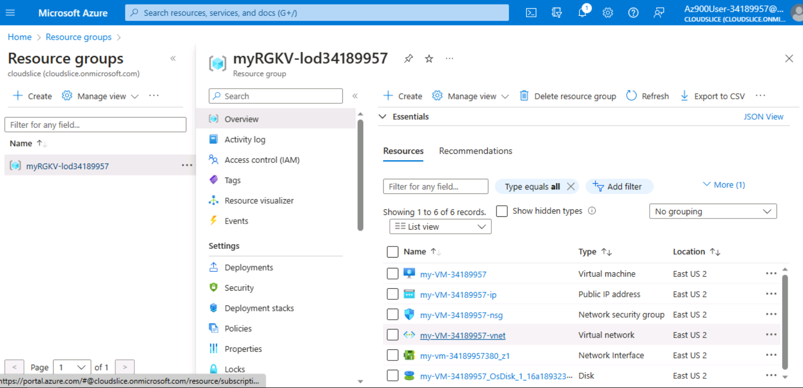
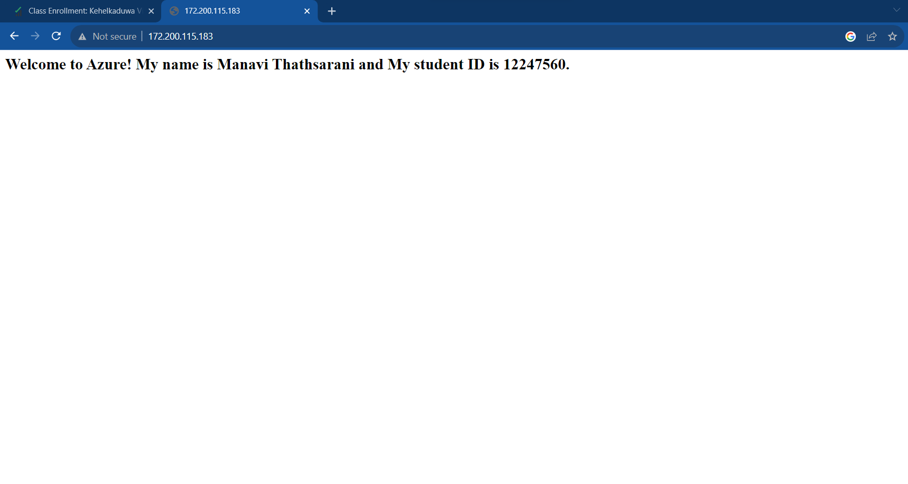
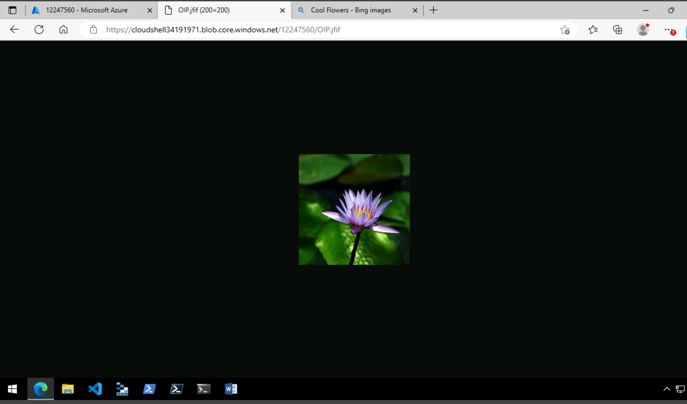
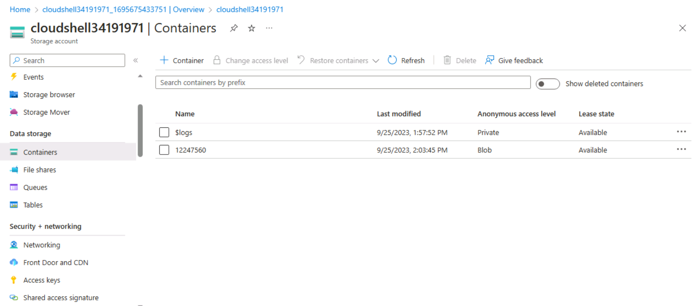

# Week 6 | 

## Task 3. Create an Azure Resource
  

Virtual Machine (VM): Azure virtual machines (VMs) are cloud-based virtualized computing instances hosted on Microsoft's infrastructure, providing a versatile and scalable platform for deploying and managing applications and services.  

Public IP Address : A public IP address is a unique numerical label assigned to a device on a network that allows it to be identified and accessed over the public internet.

Virtual Network : A virtual machine resides on a virtual network, an isolated network segment within Azure, providing network connectivity to the virtual machine and enabling users to define IP address ranges, subnets, and network routing configurations.

The Network Interface : This is integral to virtual machines (VMs), enabling their connection to virtual networks by linking them to public IP addresses and Network Security Groups (NSGs). It actively manages network traffic to and from the VM, acting as a bridge that facilitates seamless communication between the VM and the broader network, ensuring efficient data transfer.

## Task 4. Create an Azure Virtual Machine and Allow Web Access
### 1.
Command to create a Linux VM:
az vm create \
--resource-group myRGKV-lod34188991 \
--name my-VM-34188991 \
--image UbuntuLTS \
--admin-username azureuser \
--generate-ssh-keys

Command to configure Nginx on your VM:
az vm extension set \
--resource-group myRGKV-lod34188991 \
--vm-name my-VM-34188991 \
--name customScript \
--publisher Microsoft.Azure.Extensions \
--version 2.1 \
--settings '{"fileUris":["https://raw.githubusercontent.com/MicrosoftDocs/mslearn-welcome-to-azure/master/configure-nginx.sh"]}' \
--protected-settings '{"commandToExecute": "./configure-nginx.sh"}'

### 2. 
Public IP Address= 172.200.115.183
### 3.
  

### 4. 
SSH (Port 22): To achieve secure remote access to your virtual machine's command-line interface, SSH (Secure Shell), a cryptographic network protocol, is employed.
HTTP (Port 80): This configuration permits web browsers to establish connections with the webserver (specifically, Nginx) running on your virtual machine (VM), as port 80 serves as the typical port for web traffic.

## Task 5. Create a Storage Blob in Azure

Screenshot of the image and the full URL to access the image.
  

Screenshot of Azure Portal resources that show the container(s).
  

## Task 6. Create a Resource Lock

Difference between a read-only lock and a delete lock : 

A read-only lock restricts any changes to data, allowing only viewing or reading of it. On the other hand, a delete lock not only prevents modifications but also prohibits the removal or deletion of the data, making it completely inaccessible.

## Task 7. Compare Cloud vs On-premise Costs

1.Consumer Desktop PC:
Specifications:  
CPU: Intel Core i5-11600K (6 cores, 12 threads)   
RAM: 16 GB DDR4  
Storage: 512 GB NVMe SSD  
Graphics: NVIDIA GeForce GTX 1660  
Operating System: Windows 10 Home  

Cost:  
Upfront Cost: Approximately $900  

2.Server:
Specifications:  
CPU: Dual Intel Xeon E5-2620 v4 (16 cores, 32 threads)  
RAM: 64 GB DDR4 ECC  
Storage: 2 x 1 TB SATA HDD (RAID 1)  
Redundancy: Redundant Power Supplies  
Operating System: Windows Server 2019 Standard  

Cost:  
Upfront Cost: Approximately $3,500  

3.Azure Virtual Machine:  
Specifications:  
CPU: 4 vCPUs (Intel Xeon E5-2673 v3)  
RAM: 14 GB  
Storage: 200 GB Standard SSD  
Operating System: Windows Server 2019 (pay-as-you-go)  

Cost:  
Upfront Cost: None, Azure VMs are billed on a pay-as-you-go basis.  
