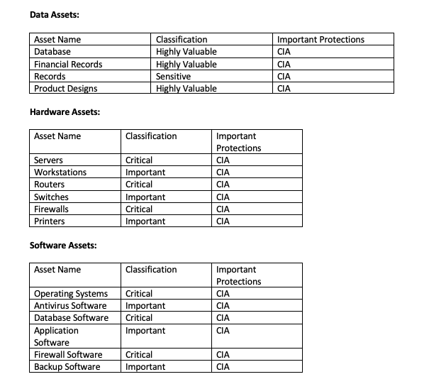
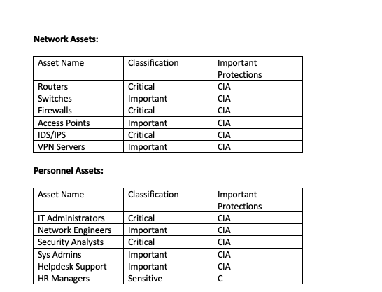

# Week 9 | Cyber Security Management

## Task 2. Select Security Objectives

- Function: Protect; Category: Access Control (PR.AC); Sub-category: 1

Importance: Access control is vital for my project because it ensures that only authorized users and devices can access network resources. In my project, which focuses on network security and real-time visibility into network devices, controlling access is critical to prevent unauthorized access to sensitive data.

Attack/Vulnerability Mitigated: This objective helps mitigate the risk of unauthorized access, which could lead to potential data breaches. For instance, it can prevent unauthorized users from gaining access to the Continuum Platform, reducing the risk of data leaks or system compromises.

- Function: Protect; Category: Data Security (PR.DS); Sub-category: 2

Importance: Data security is a top priority for my project because it involves storing and managing sensitive network and security status data. Protecting the confidentiality, integrity, and availability of this data is essential to ensure the trustworthiness of our security infrastructure.

Attack/Vulnerability Mitigated: This objective helps mitigate the risk of data breaches and unauthorized access to sensitive information. It ensures that data generated by the Continuum Platform is securely stored and encrypted, reducing the risk of data exposure or tampering.

- Function: Detect; Category: Information Protection Processes and Procedures (PR.IP); Sub-category: 3

Importance: Detecting changes in network configurations and communication baselines is crucial for my project. Having accurate and up-to-date information about network behaviors is essential for identifying anomalies and potential security threats.

Attack/Vulnerability Mitigated: This objective helps mitigate the risk of configuration errors or unauthorized changes in network settings. By maintaining a baseline of network design and configuration, this objective enables early detection of deviations that may indicate a security incident.

- Function: Detect; Category: Anomalies and Events (DE.AE); Sub-category: 4

Importance: Detecting and blocking activities that precede an attack is a priority in my project. Proactive threat detection and response align with our project's goal of ensuring robust security.

Attack/Vulnerability Mitigated: This objective helps mitigate the risk of advanced threats and targeted attacks. By detecting suspicious activities and correlating events across different levels of control, this objective assists in identifying and responding to potential cyber threats before they can cause significant harm.

## Task 3. Create Asset Inventory 

  
  

