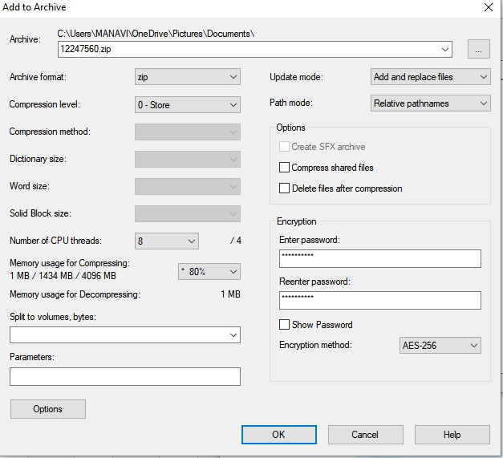
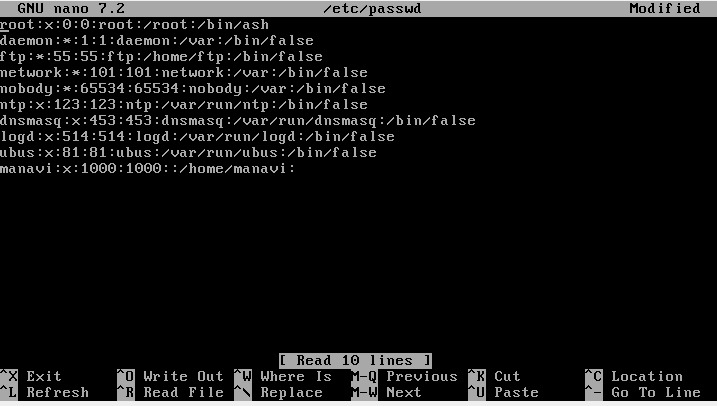
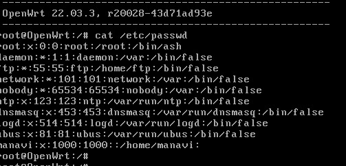

# Week 10 | Cyber Security Controls

## Task 2 Encrypt a File 

  

### Sharing the Secret Key:

-	In our project, we initially shared the secret key through a secure, encrypted channel. We used a secure messaging service that employs end-to-end encryption to ensure that the key couldn't be intercepted during transmission. Additionally, we limited access to the key by sharing it only with authorized team members who required it for their specific tasks.

#### Limitations of this Approach:

While our method was relatively secure, it still had its limitations. For instance:

-	Trust in the Messaging Service: Our approach relied on the trustworthiness of the messaging service provider. If the provider's security were compromised, our key could be at risk.
-	Human Error: There is always a potential for human error, such as accidentally sharing the key with the wrong person or mismanaging access permissions.
-	Key Expiration: We did not implement an automatic key expiration mechanism. If a key is compromised and we are not aware of it, there's no safeguard in place to limit its use.

#### Recommendations for More Secure Key Sharing:

To enhance the security of key sharing in our project, we can consider the following recommendations:

-	Zero-Knowledge Encryption: Implement a zero-knowledge encryption method where the key-sharing service provider has zero knowledge of the key itself. This way, even if the provider is compromised, the key remains secure.
-	Multi-Factor Authentication: Require multi-factor authentication for accessing the key. This adds an extra layer of security, ensuring that only authorized users can decrypt and use the key.
-	Regular Key Rotation: Implement a key rotation policy. Periodically generate new keys and replace the old ones. This reduces the risk associated with long-term key use.
-	Key Management Tools: Invest in robust key management tools that allow us to automate key generation, distribution, and revocation processes securely.
-	User Training: Conduct regular security awareness training for all team members to minimize the risk of human error. Ensure that everyone understands the importance of keeping the key confidential.
-	Monitoring and Alerts: Set up monitoring systems to detect any unusual key activity and send alerts in case of suspicious behavior.

## Task 3 View Password Information Stored in Linux

### etc/shadow
  

### cat /etc/password
  

### Explanation of /etc/shadow Contents:

-	Username (Login): This field holds the username associated with the user account for which password management is in place.

-	Password Hash (Hashed Password): Instead of storing the actual user passwords, /etc/shadow stores hashed versions of these passwords. Hashing involves applying a cryptographic function to the passwords, resulting in a fixed-length string of characters. These hash values are what get stored in this field. Importantly, these hashes cannot be reversed to reveal the original passwords.

-	Last Password Change Date: This field records the date when the user last altered their password. It's represented as the number of days since January 1, 1970, known as Unix epoch time, to indicate when the password change occurred.

-	Password Expiry and Aging Information: /etc/shadow contains fields specifying password expiration and aging policies. These include settings such as the maximum password age, minimum password age, and grace period.

-	Account Locking Information: Fields are present that determine if an account is locked, when it will be locked (if applicable), and when the last locking event occurred. These fields help in managing user account access.

-	Password Warning Period: This field defines the number of days before a password expires when the user should be warned about the upcoming expiration.

-	Account Inactivity Period: In case account inactivity is enforced, this field specifies the number of days of inactivity that would lead to an account lock.

-	Account Expiration Date: If applicable, this field signifies the date on which the user account will expire.

### Why Actual Passwords Aren't Stored:

-	Enhanced Security: Storing actual passwords in plaintext would pose a significant security risk. If an unauthorized party gained access to the /etc/shadow file, they could immediately obtain all user passwords, severely compromising system security. Hashed passwords are significantly more secure as they are extremely difficult to reverse-engineer.

-	Reduced Liability: By not storing actual passwords, system administrators and organizations minimize their liability in the event of a data breach. Even if an attacker were to access the hashed passwords, they wouldn't be immediately usable without significant effort to crack them.

-	Password Verification: During the login process, the system hashes the entered password and compares it to the stored hash in /etc/shadow. If they match, access is granted. This approach allows for password verification without exposing the actual password.
  
## Task 4. Essential Eight Mitigation Strategies

- Selected Strategies:

### 1. Application Whitelisting (Prevent Malware Delivery and Execution):

In our project, we will implement application whitelisting by creating a list of approved applications that are allowed to run on our systems. These approved applications will be thoroughly reviewed for security and functionality.
We will use Group Policy or similar tools to enforce the policy across all endpoints in our organization.
By doing this, we prevent unauthorized or potentially malicious applications from executing, reducing the risk of malware infection.

### 2. Patch Applications (Prevent Malware Delivery and Execution):

We will regularly patch and update all applications used in our project, including operating systems, web browsers, and third-party software.
We will establish a patch management process that includes testing patches in a controlled environment before deploying them to production systems.
This strategy ensures that known vulnerabilities are addressed promptly, reducing the risk of cyberattacks exploiting these vulnerabilities.

### 3. User Application Hardening (Limit the Extent of Cyber Security Incidents):

To limit the extent of cyber incidents, we will enforce user application hardening by configuring web browsers and email clients to block potentially harmful content, such as malicious scripts and attachments.
We will educate our project team members about safe browsing practices and the importance of not clicking on suspicious links or downloading unknown attachments.
This approach helps in reducing the attack surface and limiting the impact of potential incidents caused by user interactions with malicious content.

### 4. Regular Data Backups (Recover Data and System Availability):

To ensure data availability and recovery, we will implement a robust backup strategy for critical project data.
We will schedule regular automated backups of project databases, documents, and configurations to a secure offsite location.
In case of data loss due to cyber incidents or other issues, we can quickly restore the project data to its last known good state, minimizing downtime and data loss.

### -  Reasons for Selection:

- We selected these strategies because they address both prevention and recovery aspects of cybersecurity.
- Application whitelisting and patch management focus on preventing malware delivery and execution, which is crucial for protecting our project's assets.
- User application hardening is essential for limiting the extent of potential cyber incidents by reducing the attack surface.
- Regular data backups ensure data and system availability, enabling us to recover from incidents swiftly.
- These strategies were chosen as they align with our project's security needs and help us establish a strong security posture.

## Task 5. Explore and Select NIST Controls

### 1. Access Control (AC-2):

-	Relevance: This control is vital as it ensures that only authorized individuals or systems gain access to our project's resources, preventing unauthorized access and potential breaches.
-	Application: In our project, we will implement this control by setting up role-based access control (RBAC). We'll define specific roles (e.g., admin, user, guest) and assign appropriate access permissions to each role. Access to project systems and data will be strictly based on these roles. For example, only administrators will have access to system configurations, while regular users will be limited to essential functions.

### 2. Audit and Accountability (AU-3):

-	Relevance: This control is crucial for tracking and monitoring activities within our project's systems, helping to detect and respond to security incidents effectively.
-	Application: In our project, we will configure system logs and establish a centralized logging system. All system and user activities will be logged, including login attempts, file access, and system changes. Regularly reviewing these logs will allow us to identify suspicious activities promptly. For instance, if multiple failed login attempts are detected, it may indicate a brute force attack, triggering an immediate response.

### 3. Security Assessment and Authorization (CA-3):

-	Relevance: This control ensures that our project's systems undergo comprehensive security assessments to identify vulnerabilities and ensure compliance with security standards.
-	Application: In our project, before any system goes live or undergoes significant changes, we will conduct thorough security assessments, including vulnerability scanning and penetration testing. This process will validate the system's security posture and compliance. For example, before launching a new web application, we will perform security assessments to identify and rectify vulnerabilities, ensuring a secure environment.

### 4. Continuous Monitoring (CM-8):

-	Relevance: Continuous monitoring is essential for maintaining a strong security posture by keeping track of system activities and potential threats in real-time.
-	Application: Our project will employ automated monitoring tools to continuously analyze network traffic, system logs, and security events. Alerts will be set up to notify our security team of any anomalies, such as unexpected data transfers or suspicious login attempts. This enables us to respond swiftly to potential security incidents.

### 5. Incident Response (IR-2):

-	Relevance: This control is critical for handling security incidents effectively, minimizing their impact on our project.
-	Application: In our project, we will create a detailed incident response plan outlining roles, responsibilities, and procedures for addressing various types of incidents. We will conduct regular drills to ensure our team is well-prepared. For instance, if a data breach is detected, our incident response plan will guide us on immediate actions, such as isolating affected systems, preserving evidence, and notifying relevant parties.

### 6. Security Training and Awareness (AT-2):

-	Relevance: This control emphasizes the importance of educating project team members about security risks and best practices, reducing the likelihood of human error leading to security incidents.
-	Application: Our project will implement mandatory security training for all team members, covering topics like phishing awareness, secure password practices, and social engineering prevention. Additionally, we will regularly disseminate security reminders and updates to keep everyone informed about the latest threats and protective measures.

